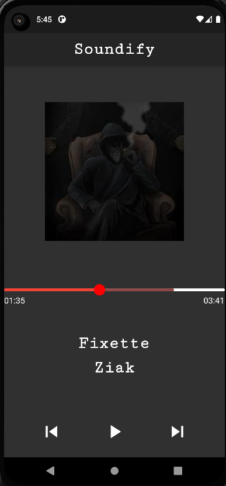

# Soundify 💿

[](https://dart.dev/)

[](https://flutter.dev/)


An application which has a list of musics. You can listen every musics, stop, play the next or the precedent song.


## Screenshots 🔍




## How to use it ✨

Clone the project, open a terminal and type :

```bash
  flutter run
```


